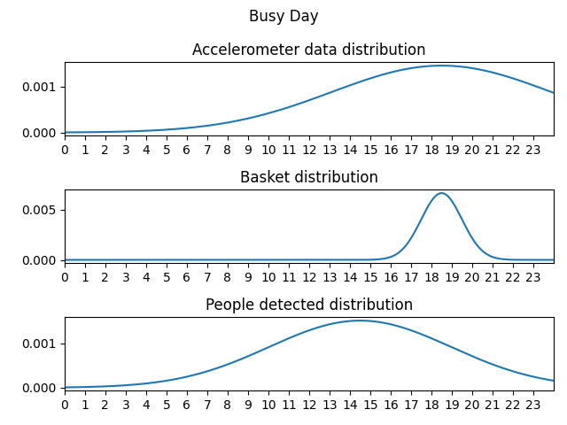
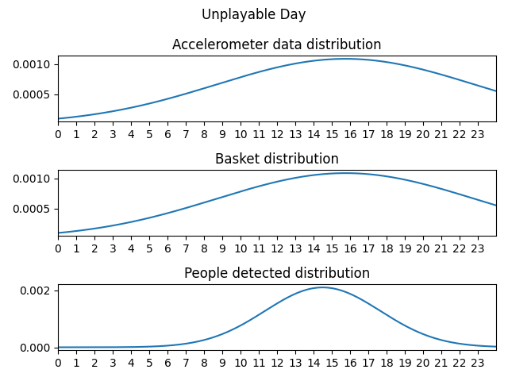
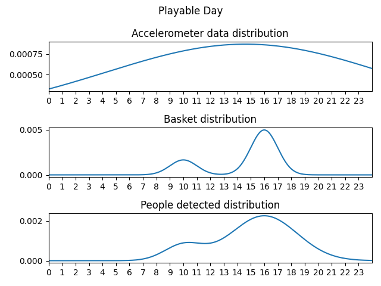

# Sample data generation

The **Sample-data generation** is the process of generating fake, but as much as realistic as possible, measurements associated to the mock Basket.

The "mock Basket" is a special Basket used for tests that is characterized by the ID `0x23232323` in hex, or `589505315` in decimal.

The problem consist in generating three type of measurements:
- **Accelerometer data**: the movement of the Basket or of the Basket board above a certain threshold.
- **People detection data**: the detection of people standing in front of the basket.
- **Basket data**: anything that occluded the IR detector (most commonly, the ball entering the basket).

The task of the generator, given a range of dates, is to generate for each day within the range fake measurements.

In order to do this, the generator distinguish three types of days in a year:
- **Busy day**: a day for example of school or of work.
- **Unplayable day**: a day that is considered to be unplayable for example because of bad weather conditions (rain or cold).
- **Playable day**: any other day.

For every day type and for every measurement type, it's built a probability distribution from which the generator will sample pseudo-realistic timestamps for the measurement.

<p align="center">
   
  
  
</p>

Even the number of timestamps drawn within a day per measurement are dependent on the day type. Trivially it's expected to have more baskets, people detected and accelerometer data on a Playable day rather than on an Unplayable day.

<p align="center">
  
   
  
</p>

### How a day is classified?

A date is classified using the following procedure:
- If a day is unplayable then it's Unplayable
- Otherwise the day is playable, but if it's busy, then it's Busy
- Otherwise it's Playable

#### Unplayable day classification

The condition for a day to be unplayable should be derived from realistic weather data. However we don't have access to a weather service that could give us the exact weather conditions back in the past and its integration would have been an over-engineering for the generation of sample fake-data.

For this purpose, it's been implemented a predicate that given a date returns whether the day was playable or unplayable. This predicate has to be deterministic, thus the day condition can't involve a random generator. The randomness has been replaced with a noise function that given a numerical representation of the date (e.g. Unix timestamp) returns a `[0, 1]` value. This value is then converted to a boolean value giving more probability to autumn/winter month' days to be unplayable and less to spring/summer days.

```python
def noise(n: float):
    return abs(modf(sin(n) * 43758.5453123)[0])

def is_unplayable_day(date: datetime):
    value = noise(mod(date.year, 5) * 365 + date.month * 31 + date.day)
    return value <= [0.9, 0.8, 0.6, 0.38, 0.3, 0.1, 0.08, 0.07, 0.1, 0.3, 0.79, 0.9][date.month - 1]
```

#### Busy day classification

A day is considered busy trivially if respects these hand-crafted conditions:
- The month is within school period (January to May or September to December)
- It's not a Sunday
- It's not Christmas holiday


